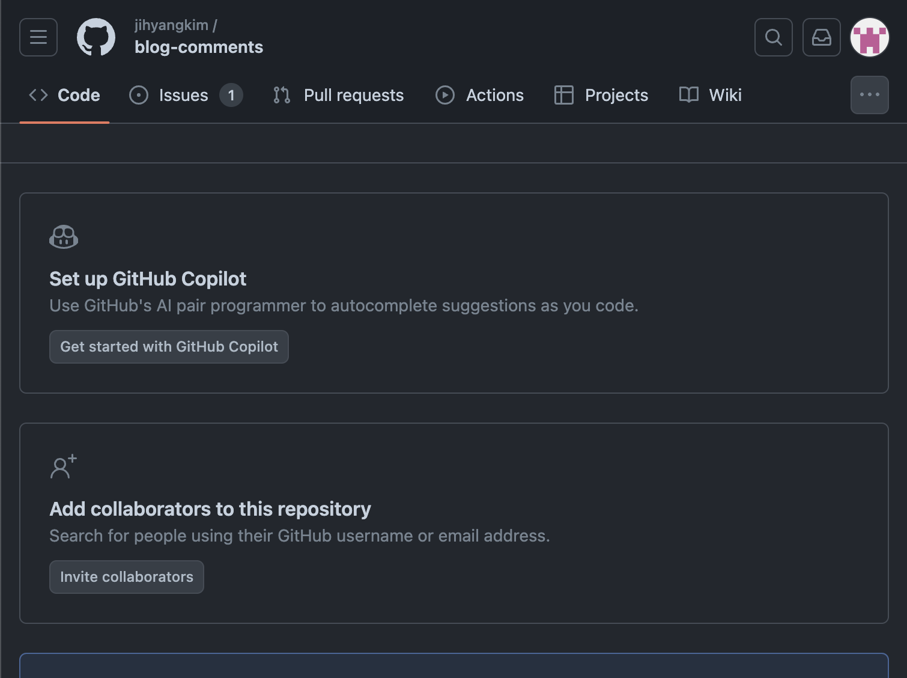

좋은 포스팅 보고 뚝딱뚝딱 댓글 앱 추가 했다.   
나도 동일한 내용으로 포스팅 해보겠다.   
일단 댓글 저장용 리포지토리를 생성한다.   



[Install Utterances](https://github.com/apps/utterances) 이 링크에서 앱을 설치하고 리포지토리를 연결해야한다.   
다음 step 은 캡처하지 못해서 출처로 남긴 블로그를 참고해보자. 😉

### React로 되어있다면 컴포넌트를 새로 만들어야한다.

`src/components/Utterances.js` 컴포넌트를 아래와 같이 작성해준다.

```js
import React from 'react'

class Utterances extends React.Component {
  constructor(props) {
    super(props)

    this.commentsEl = React.createRef()
    this.state = { status: 'pending' }
  }

  componentDidMount() {
    const scriptEl = document.createElement('script')
    scriptEl.onload = () => this.setState({ status: 'success' })
    scriptEl.onerror = () => this.setState({ status: 'failed' })
    scriptEl.async = true
    scriptEl.src = 'https://utteranc.es/client.js'
    scriptEl.setAttribute('repo', 'jihyangkim/blog-comments')
    scriptEl.setAttribute('issue-term', 'title')
    scriptEl.setAttribute('theme', 'github-light')
    scriptEl.setAttribute('crossorigin', 'anonymous')
    this.commentsEl.current.appendChild(scriptEl)
  }

  render() {
    const { status } = this.state

    return (
      <div className="comments-wrapper">
        {status === 'failed' && <div>Error. Please try again.</div>}
        {status === 'pending' && <div>Loading script...</div>}
        <div ref={this.commentsEl} />
      </div>
    )
  }
}

export default Utterances
```

해당 컴포넌트를 원하는 곳에 넣어주면 끝이다!

후기 github 댓글 설치해서 했는데 약간 로드가 느린듯 하다. 로컬 테스트라서 그런가(?)

출처 : [gatsby utterances 댓글 앱 추가](https://sungchul-p.github.io/gatsby-utterances)
