오늘은 이른 여름 휴가를 위해 춘천을 가는날이다.   
계곡을 가기로 했는데, 아침부터 비가 온다.   
부슬비라 그냥 맞고 감 ㅎ   

아침부터 엄청난 어그로에 당해버렸다.   
> 예지니 : 너 왜 안나오셈?   
> 나 : ??? 아직 멀었잖아유   
> 예지니 :  아냐 우리 앞차 타기로 했어.   
> 나 : !!!!?!?!!?
어찌된 사실이냐면. 강동구 여자들끼리 나를 버리고 가려고 했단다.   
지하철을 믿을수가 없다며.   
말이라도 해주시라고요.   

얼른 준비하고 상봉역에서 강동구 여자들 만났다.😠😡😠😡   

나머지 두친구는 itx를 타고 온다고 했다.   
우리는 앞차를 탔고, 다행히 앉아서 출발했다.

예미니가 챙겨온 초콜릿을 먹었는데, 산타가 양파망 같은데 들어있다.

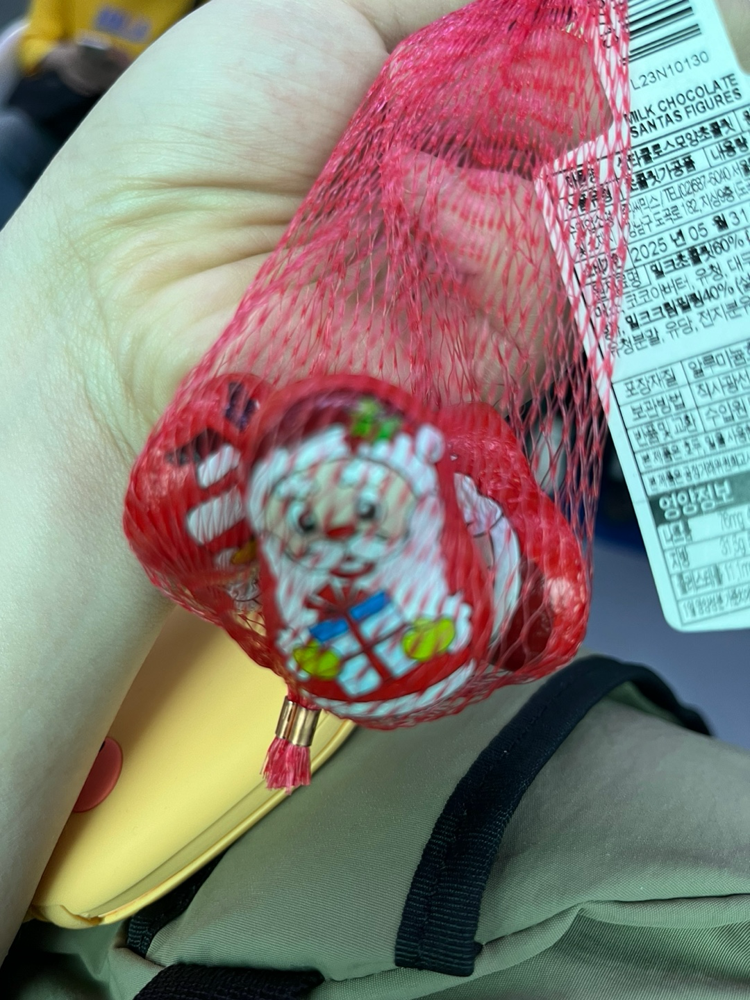

가는길에 새벽까지 달린 여자들은 잠을 청했다. 나는 쌩쌩😚

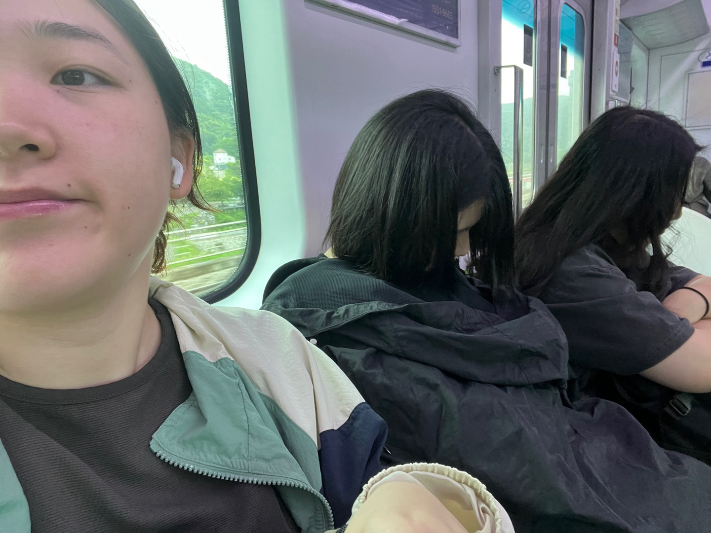

장장 1시간 반동안 지하철 타고 춘천에 도착했다.   
내려서 쏘카에서 빌린 차 어딨는지 찾고, 배고픈 나머지 눈 앞에 보이는 철판 닭갈비집을 가기로 했다.  (사실 그냥 가자고 함 ㅎ)

가게 이름은 [샘토숯불닭갈비](https://naver.me/GHvrapbx)   
사람이 있는데 오픈 시간이 오후 5시라서 의아한 상태로 앞을 서성거렸다.   
그랬더니 사장님이 "몇명이야~ 서울에서 왔어? 밥먹으려고?" 라며 말을 걸어주셨고,   
두명인줄 아셨던 사장님을 들어오라고 했지만 "저희 5명이여요 ㅎ"   
단단히 속은 사장님 😁   

우리는 그렇게 앉을 수 있었는데, 여기는 특이한 정책? 법칙? 규칙? 이 있다고 했다.   
"건강" 하면 "행복" 이라고 외쳐야 밥을 먹을 수 있다고 한다.   
뭔가 잘못됨을 느끼고 다같이 눈을 마주쳤다 ㄷㄷ.   
일단 들여보내주신 사장님을 따랐다.

주문하려고 벨을 누르자 사장님이 "여기는 내가 알아서 줘. 가만히 있어."   
주문도 못하게 하구 ㅠ 얌전히 있었다. 그러면서 20대냐구 20대라 들여보내주셨단다.   
그랬더니 예미니가 재언이는 못들어오겠다 ㅋ 이러면서 단톡방에 보냄 ㅋㅋ   
늦게 온 친구들도 도착하고, 닭갈비 먹기도 전에 다들 기가 빨리고 있었다.   

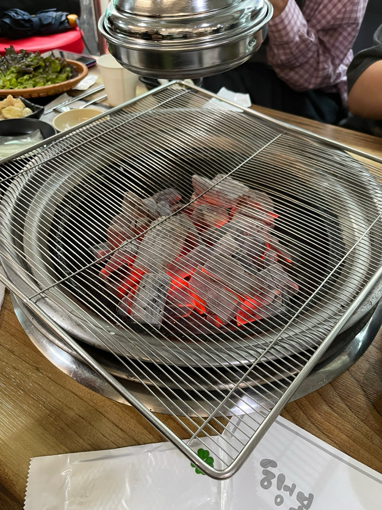 | 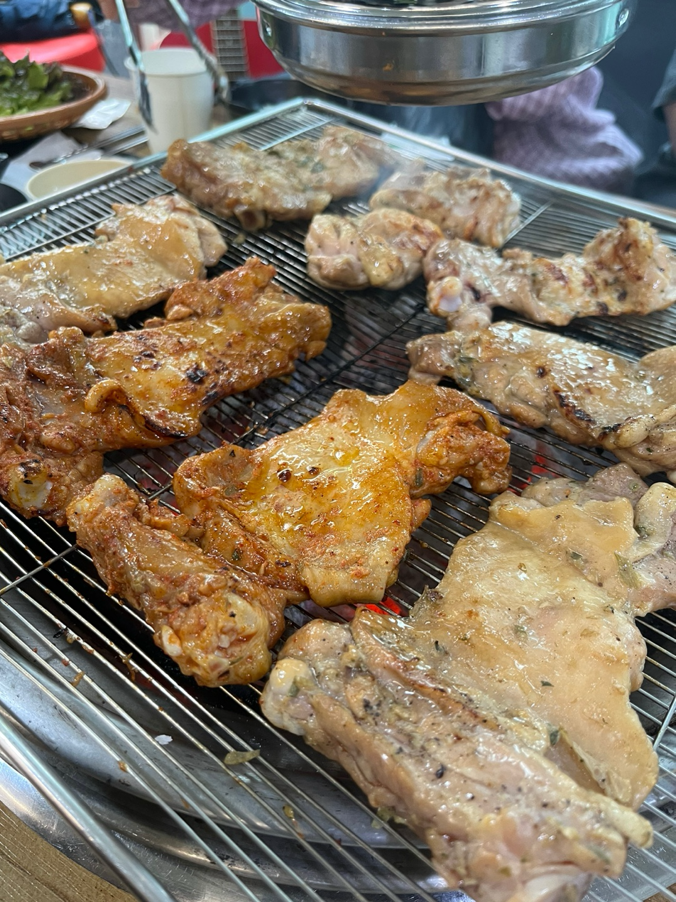
---|---|

닭갈비가 나왔고, 정말정말 맛있었다. 그리고 중간 중간 틀어주는 음악 맞추면 고기를 서비스로 주셨다.   
배 터지도록 먹었는데 5명이서 7만원 나왔다.   
사장님이 베푸는걸 좋아하신다고 한다. 사장님 기 빨리지만 인심 최고 👍   

밥 다먹고 날이 싹 개서 우리는 장을 보고 계곡을 가기로 했다.   
오랜만에 운전이라 살짝 긴장했다 ㅎ 네비가 반응이 너무 느려서 길을 잘못 들었지만 어찌저찌 무사 도착.   
주차도 완벽하게 했다. ✌️   

장을 잔뜩보고 숙소로 향했다. 가는길에 쌈배 산다고 편의점 찾고 찾아서 갔다가 또 길 잘못 들어서 한바퀴 돌았다.   
뺑글사 하기 전에 집중해서 숙소로 갔다.

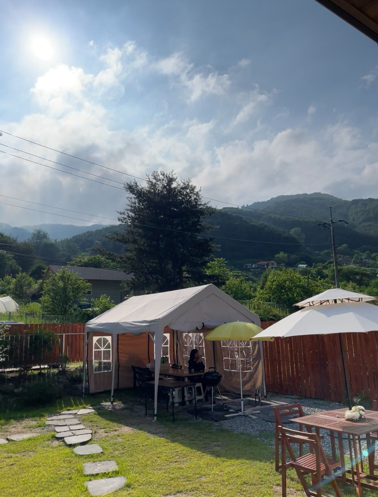

숙소가 너무너무 좋았다. 바베큐장도 있고, 내부에 계곡도 있고.   
옷을 갈아입고, 계곡으로 향했다.

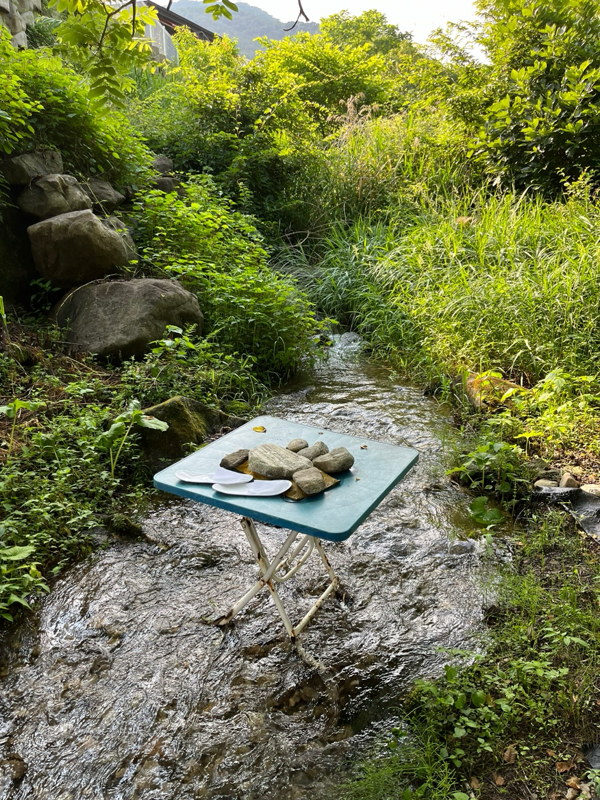

계곡 얕은데 너무너무 차가워서 10분도 안있다가 올라왔다.   
올라와서 각자 쉬는 시간을 보내고 야구도 보면서, 언녕이가 갑자기 산 `박이` 사진도 찍었다.

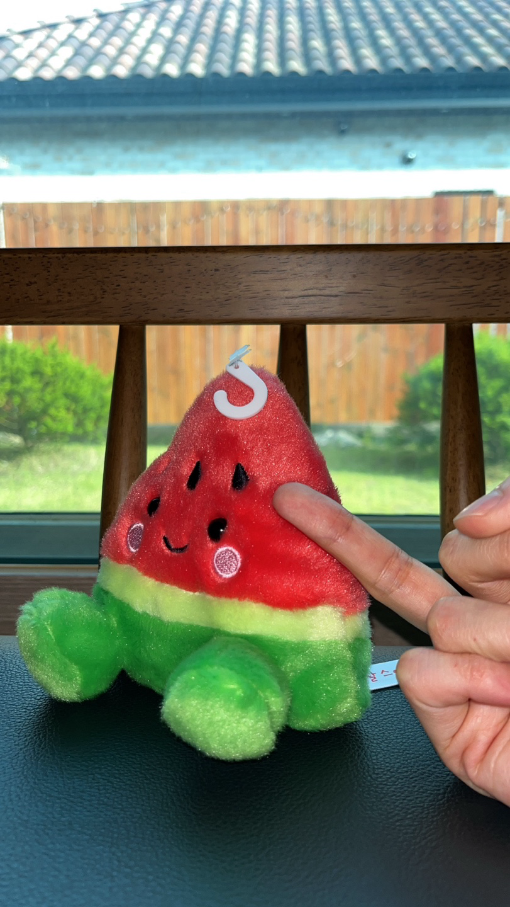

냅다 뻐큐하는 재언이 ㄷㄷ

다들 갑자기 잠을 청하기 시작했다. 여섯시반에 바베큐를 하자던 친구들은.   
7시까지 무소식이였다.   
하나둘 깨우고 바베큐하러 밖으로 나갔다.   
산속이라 벌레 천국.   

열정적으로 고기를 꾸웠다.
고기 꿉는 동안 친구들이 비빔면과 쌈을 준비해왔다. 냠냠긋😋

 |  | 
--|--|--|

열심히 얘기하면서 밥먹다가 왕큰벌레 출몰.   
다같이 디지버지듯이 피했다.   
용감한 재언이가 잡아줌 😎   

으 진짜 너무 커.
벌레 퇴치하고 마시멜로까지 야무지게 먹고 있었는데,   
**왕귀여운 예삐 등장.**

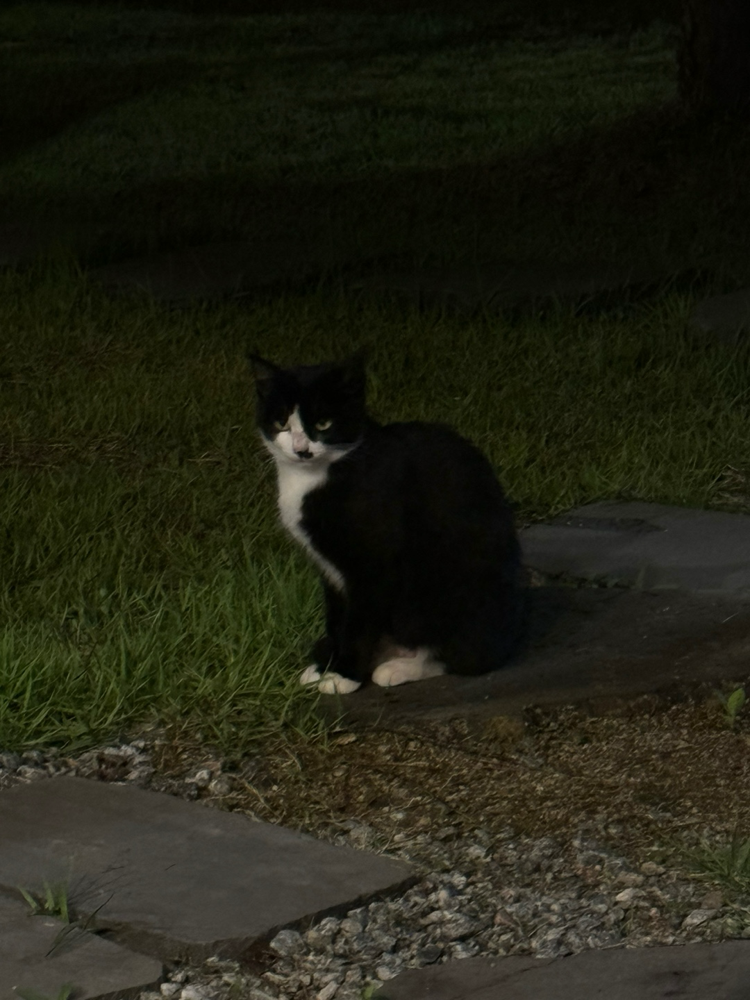

예삐 구경하고 남은 고기 던져주고, 숙소 안으로 들어가서 2차전 했다.   
수박도 먹고 오이도 먹고 샤인머스켓도 먹고 야무지게 먹었다.   
하지만 끝나지 않았어.   

 | 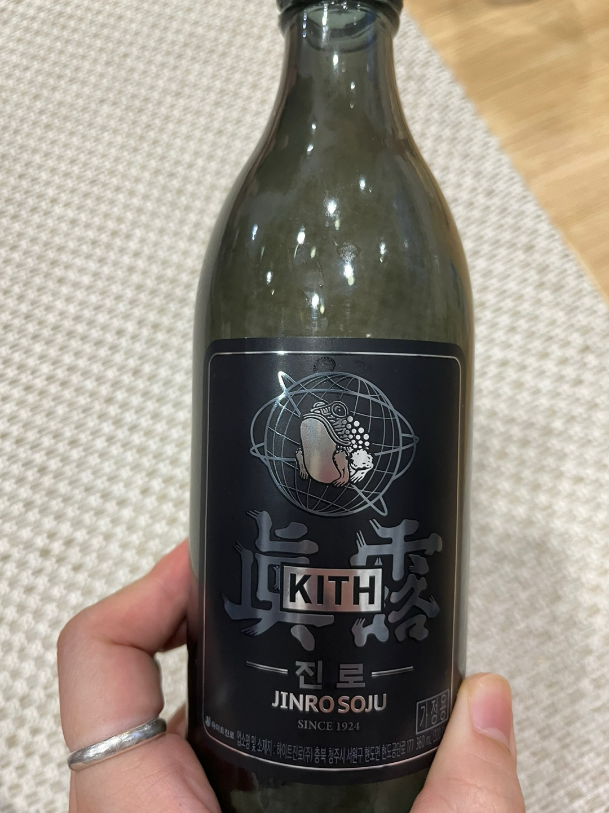
--|--|

깜짝 서프라이즈로 사온 엽떡에 물만두까지 티겨서 끊임없이 먹었다.   
술 사면서 새로운 병을 마주하여 주저없이 산 진로. 맛은 똑같다고 한다.   
먹으면서 음악 맞추기 게임하다가 춤추고 놀았다.

그렇게 새벽 4시반인가 까지 놀다가 치우고 나니까 밖에 해가 뜨고 있었다.
얼른 잠을 잤다 운전해야하니께~~   

눈 뜨자마자 설거지 하고 어찌저찌 준비했는데, 체크아웃 시간이 너무 빨라서 좀 늦게 나가려다가
주인님이 얼른 나가라고 문자가 와서 어영부영 나왔다.   

어제 못 갔던 예삐 있는 카페를 가자고 했다 ㅎ   
카페를 갔는데 예삐는 커녕 아무것도 없어서 음료 시키고 쉬다가 화장실을 갔는데.
바로 옆에 문 뒤로 예삐가 자고 있는게 아닌가...!!!!!   

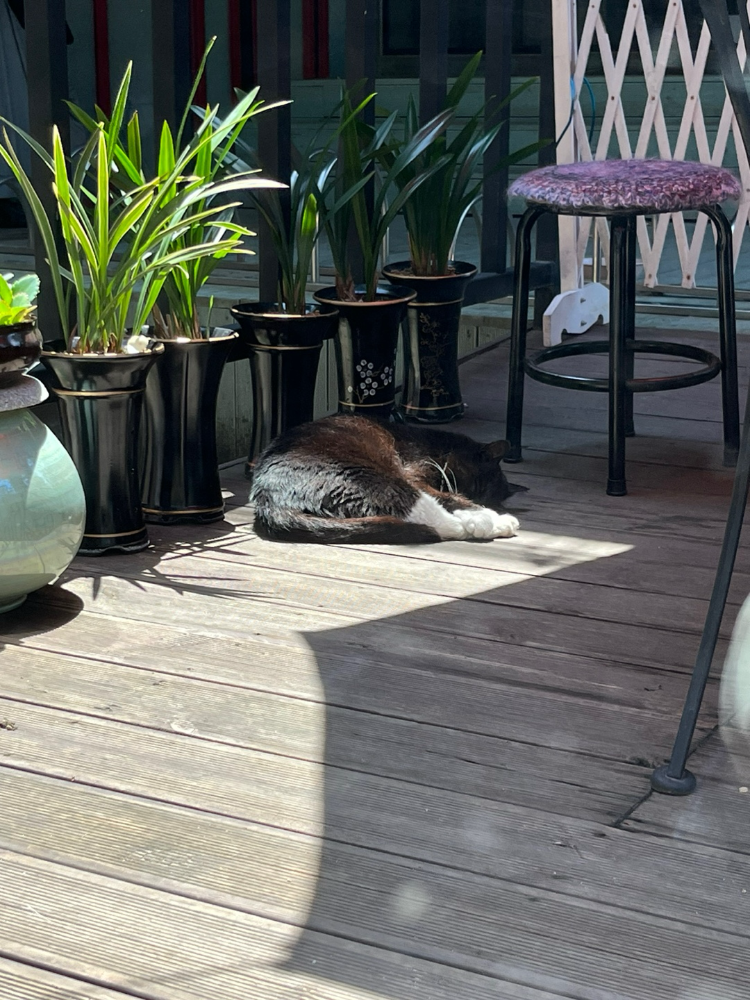 | 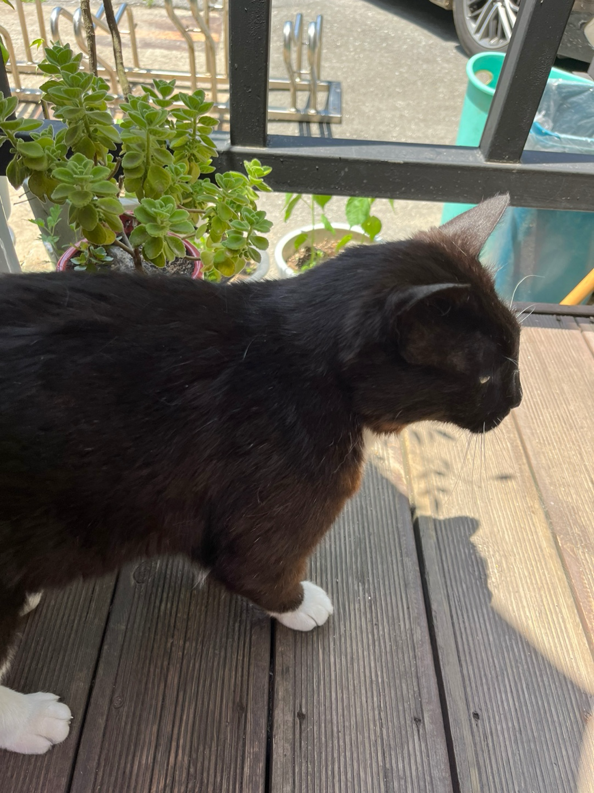
--|--|

원하던 예삐까지 보고 쏘카 반납 시간이 다돼서 얼른 출발했다.   
주차장 도착했는데, 원하는대로 주차가 잘되지 않아 진땀을 뺏다 😅   
주차 5분 걸렸는데 나가는 차가 빵빵거리지도 않고 잘 기다려주었다 휴우,,   
주차 연습을 좀 해야겠다고 생각했다 🥹   
딱 맞게 지하철이 있어서 itx 타는 친구들과 헤어지고 집으로 출발~!   

예지니는 숙취로 타자마자 잠을 청했고, 그녀가 잠을 자는 사이 예미니한테 우리 내리면 배고플것 같다며
마라탕을 먹자고 꼬셨다 ㅎ   

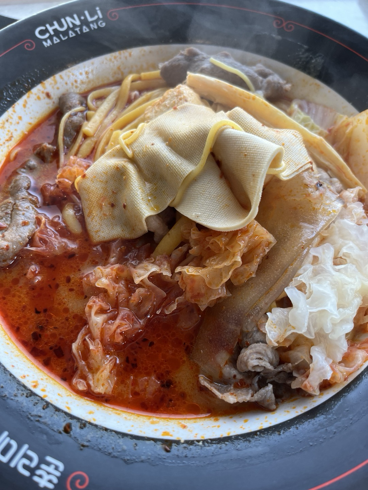

때깔 죽이는 마라탕 먹고 이번 여행은 마무리 끝~!